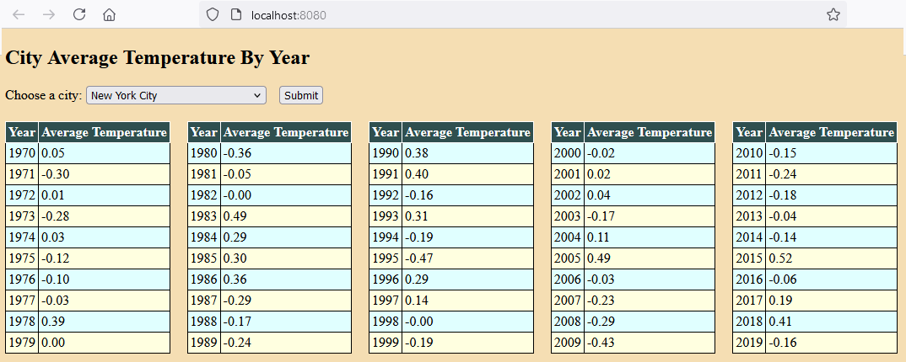

# large-file-reading-challenge

<a href="https://github.com/Ee-Cs/large-file-reading-challenge/blob/main/docs/mermaid/stateDiagram.md">Using MappedByteBuffer</a>

The 3GB data file <i>city_temperatures.csv</i> content

The application is using the 
<a href="https://docs.oracle.com/en/java/javase/22/docs/api/java.base/java/nio/MappedByteBuffer.html">MappedByteBuffer</a> 
 - a direct byte buffer whose content is a memory-mapped region of a file.
The CSV file is read and the computed average temperatures are kept in Map object.
For every next request to the endpoint CSV data file modification time is checked.
The file is reread if it was externally changed. 

<ul>
<li>file format - comma separated values</li>
<li>one hundred biggest US cities</li>
<li>a half-century of samples 
    (temperature sampled every half an hour)
    <ul>
        <li>first date is 1970-01-01 01:00:00 
        (one o'clock at night)</li>
        <li>last  date is 2019-12-31 23:30:00</li>
    </ul>
    </li>
<li>the temperatures were between -50 and 50 degrees</li>
</ul>

For the data filled with random temperatures
expected yearly average should be near zero.  

The controller tests use JUnit Jupiter and MockMvc. 

