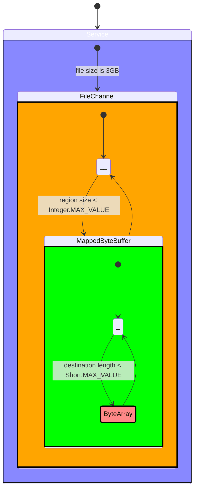

```mermaid
stateDiagram-v2
    [*] --> Service
    state Service {
        [*] --> FileChannel : file size is 3GB
        state FileChannel {
            
            [*] --> __
            __ --> MappedByteBuffer : region size < Integer.MAX_VALUE
            MappedByteBuffer --> __

            state MappedByteBuffer {
                [*] --> _
                _ --> ByteArray : destination length < Short.MAX_VALUE
                ByteArray --> _
            }
        }
    }
    class Service blueBox
    class FileChannel orangeBox
    class MappedByteBuffer greenBox
    class ByteArray redBox
    classDef redBox     fill:#ff8888,stroke:#000,stroke-width:3px
    classDef greenBox   fill:#00ff00,stroke:#000,stroke-width:3px
    classDef blueBox    fill:#8888ff,stroke:#000,stroke-width:1px,color:#fff
    classDef orangeBox  fill:#ffa500,stroke:#000,stroke-width:3px
```