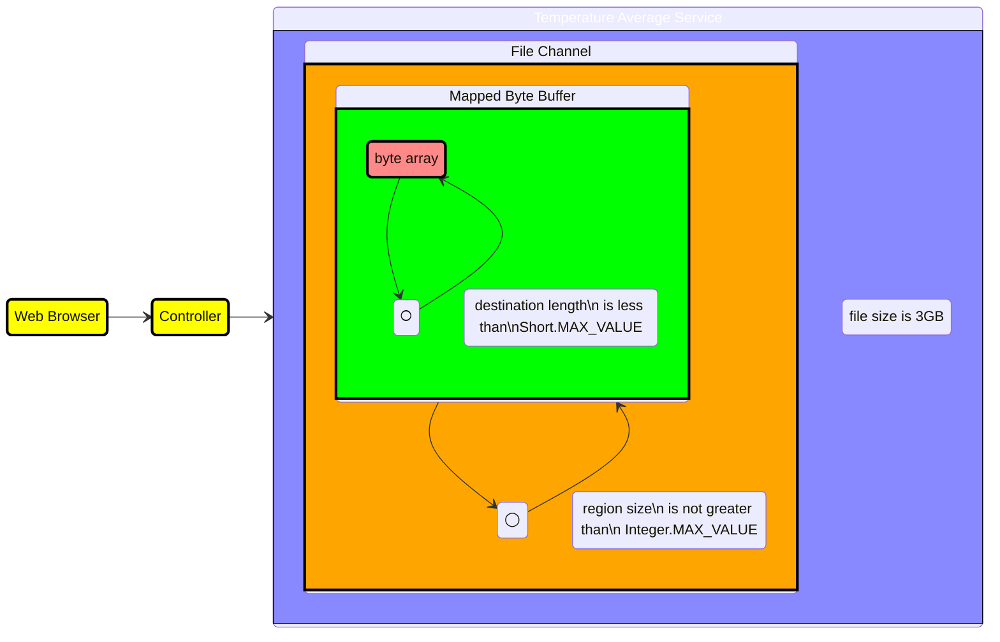

```mermaid
stateDiagram-v2
    direction LR
    state "Temperature Average Service" as SRV
    state "File Channel" as FCH
    state "Mapped Byte Buffer" as MBB
    state "byte array" as BA
    state "Web Browser" as WB
    state "Controller" as CT
    state SRV {
        state FCH {
            state MBB {
                state "destination length\n is less than\nShort.MAX_VALUE" as desc1
                🞅 --> BA
                BA --> 🞅
            }
            state "region size\n is not greater than\n Integer.MAX_VALUE" as desc2
            ◯ --> MBB 
            MBB --> ◯
        }
        state "file size is 3GB" as desc3
    }
    WB --> CT
    CT --> SRV

    class WB yellowBox
    class CT yellowBox
    class SRV blueBox
    class FCH orangeBox
    class MBB greenBox
    class BA redBox
    classDef redBox     fill:#ff8888,stroke:#000,stroke-width:3px
    classDef greenBox   fill:#00ff00,stroke:#000,stroke-width:3px
    classDef blueBox    fill:#8888ff,stroke:#000,stroke-width:1px,color:#fff
    classDef orangeBox  fill:#ffa500,stroke:#000,stroke-width:3px
    classDef yellowBox  fill:#ffff00,stroke:#000,stroke-width:3px
    
```